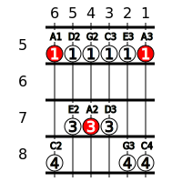
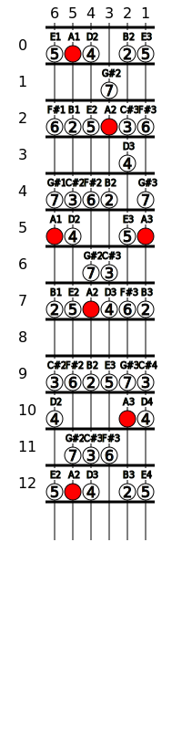

# Notenav

A Clojure library designed to help with learning guitar and music theory.

## Usage

```lookup.clj``` find/lookup notes or fret positions

```svg.clj``` create diagrams in svg.

```svg/fingerboard``` can be used to create a fingerboard diagrams
for chords and scales.

Calling:
```
(svg/fingerboard {:5 ["1R" "1" "1" "1" "1" "1R"]
                  :6 []
                  :7 ["" "3" "3R" "3" "" ""]
                  :8 ["4" "" "" "" "4" "4"]})
```
Will produce:



Can create scale diagrams like this:
```
(fingerboard
    (scale/to-diagram "A" scale/major)
    20 20 {:width 200 :height 800}))
```


## License

Copyright © 2020 Evgeniy Latuhin

This program and the accompanying materials are made available under the
terms of the Eclipse Public License 2.0 which is available at
http://www.eclipse.org/legal/epl-2.0.

This Source Code may also be made available under the following Secondary
Licenses when the conditions for such availability set forth in the Eclipse
Public License, v. 2.0 are satisfied: GNU General Public License as published by
the Free Software Foundation, either version 2 of the License, or (at your
option) any later version, with the GNU Classpath Exception which is available
at https://www.gnu.org/software/classpath/license.html.
